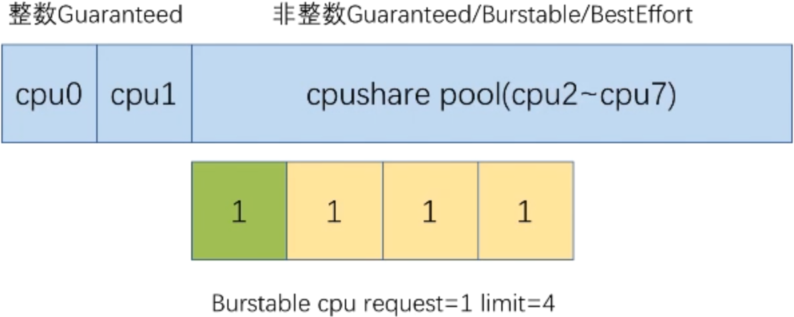

# Pod QoS

Quality of Service.

QoS:
- Guaranteed - High.
- Burstable  - Middle.
- BestEffort - Low, do your best.

QoS is Implicit: Users can not defined the QoS explicit.
- Guaranteed: CPU/Memory requests and limits are equal..
- Burstable: CPU/Memory requests and limits are **NOT** equal.
- BestEffort: All resources must have their requests/limits left unset.

# The behavior of different QoS classes

## CPU

Allocate weights based on requests.

With `--cpu-manager-policy=static`, guaranteed Pods with whole integer CPU requests will have CPUs pinned.

## Memory

Divide OOM scores based on QoS classes.
- Guaranteed: `~ 998`
- Burstable:  `2 ~ 999`
- BestEffort: 1000

?The **higher** the score, the **higher** the priority to be killed.

## Eviction

- Prioritize `BestEffort`.

